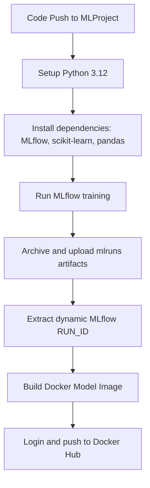

# 🚀 MLOps Model Training & Automated CI/CD Pipeline

[](https://github.com/wildaafn/Workflow-CI-wildaafn/actions/workflows/ci.yml)

An enterprise-grade MLOps repository implementing continuous integration (CI) for machine learning models. This repository orchestrates training, parameter/metric tracking using **MLflow**, and automates the build-and-deploy pipeline using **Docker** and **GitHub Actions** to package and publish a containerized version of the model.

---

## 📌 Ringkasan Proyek / Project Summary

*   **Fungsi Medis (Medical Function):** Alur kerja MLOps ini mengambil dataset preprocessed breast cancer untuk melatih model Random Forest Classifier secara terstandarisasi, guna **mengklasifikasikan keganasan sel kanker payudara secara akurat**.
*   **Fungsi Teknologi (Technical Function):** Menyediakan sistem **Continuous Integration (CI)** yang otomatis melatih model menggunakan MLflow, melacak parameter/metrik eksperimen, serta membungkus model ke dalam Docker Container dan mempublikasikannya ke Docker Hub (`ml-model:latest`) setiap kali kode di folder `MLProject` diperbarui.

---

## 📂 Repository Structure

```bash
Workflow-CI/
├── .github/
│   └── workflows/
│       └── ci.yml                     # Continuous Integration workflow
├── MLProject/
│   ├── MLProject                      # MLflow Project configuration file
│   ├── conda.yaml                     # MLflow environment dependencies
│   ├── modelling.py                   # Model training and tuning script
│   ├── breast_cancer_preprocessing.csv# Inputs from the preprocessing stage
│   └── Tautan ke Docker Hub.txt       # Docker Hub link reference
└── README.md                          # Project Documentation
```

---

## ✨ Features

* **MLflow Project Structure:** Configured with standard parameters and metadata for easily reproducible local and cloud-based executions.
* **Continuous Integration (CI):** Every push to the `MLProject` directory triggers a fully automated training run on GitHub runners.
* **Model Artifact Archiving:** Packages and uploads `mlruns` metadata as run artifacts.
* **Automated Dockerization:** Dynamically builds a Docker container exposing the trained scikit-learn model using `mlflow models build-docker`.
* **Container Register Publishing:** Automatically logs in and pushes the resulting image to Docker Hub at `DOCKER_USER/ml-model:latest`.

---

## 🤖 CI Pipeline: Step-by-Step

The continuous integration pipeline is defined in `.github/workflows/ci.yml`:



### GitHub Secrets Requirements
To enable container publishing, configure the following secrets in your repository (**Settings** -> **Secrets and variables** -> **Actions**):
* `DOCKER_USERNAME`: Your Docker Hub username.
* `DOCKER_PASSWORD`: Your Docker Hub password or Personal Access Token (PAT).

---

## 💻 Running Locally

### Prerequisites
* Python 3.12+
* Docker Desktop (for container builds)
* Virtualenv (`pip install virtualenv`)

### Local Training Execution
1. Clone this repository:
   ```bash
   git clone https://github.com/wildaafn/Workflow-CI-wildaafn.git
   cd Workflow-CI-wildaafn
   ```
2. Run the MLflow Project:
   ```bash
   cd MLProject
   python -m mlflow run . --env-manager=local
   ```
3. This runs `modelling.py`, trains a `RandomForestClassifier`, performs hyperparameter tuning, and logs parameters, metrics (like accuracy, precision, recall), and the model pickle into the `mlruns` directory.

### Local Docker Build
To build the Docker image locally:
1. Extract your `RUN_ID` from the `mlruns` directory:
   ```bash
   RUN_ID=$(ls mlruns/0 | grep -v meta.yaml | grep -v datasets | head -n 1)
   ```
2. Build the Docker image:
   ```bash
   mlflow models build-docker -m "runs:/$RUN_ID/model" -n "ml-model:latest" --env-manager=local
   ```
3. Run the container:
   ```bash
   docker run -p 8000:8080 ml-model:latest
   ```
